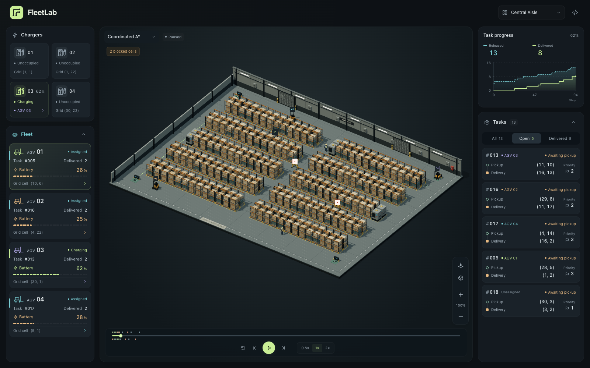

<div align="center">

# FleetLab

Coordinated forklifts. Shared factory floors. Interactive 3D simulation replays.

[](https://github.com/Revincxt/FleetLab/actions/workflows/ci.yml)
[](web/package.json)
[](LICENSE)

**[Live demo](https://revincxt.github.io/FleetLab/)** · [Quick start](#quick-start)

</div>

[](https://revincxt.github.io/FleetLab/)

## Overview

FleetLab simulates warehouse fleets sharing tasks, navigating traffic, and recharging.
A Python simulator generates reproducible runs; the 3D web viewer lets you explore them.

- **Factory floor** — Four layouts with working forklifts, visible cargo, and three patrolling workers that planners avoid.
- **Task routes** — Inspect the selected forklift's current task: solid lines show travel so far, dashed lines show its recorded plan. Finished task markers disappear.
- **Operations** — Seeded tasks arrive progressively. Track the fleet, charging stations, and task queue with playback and timeline controls.

## Routing algorithms

| Algorithm | Approach |
| --- | --- |
| Coordinated A* | Occupancy-aware A* with per-step cell and edge reservations. |
| WHCA* | Windowed space-time planning with rotating vehicle priority. |
| RHCR + PBS | Rolling-horizon planning with conflict-driven priority search. |

Switch between recorded runs using the algorithm selector. All three use the same task
allocation and charging rules; windowed planners display their current planning horizon.

## Quick start

Requires **Node.js 22.13+**, **pnpm 11**, and a WebGL-capable browser.

From the repository root:

```bash
cd web
pnpm install --frozen-lockfile
pnpm dev
```

Open the local URL printed by the dev server. Replay data is included;
no Python process is needed to use the viewer.

<details>
<summary>Generate new replays with Python</summary>

From the repository root, with **Python 3.11+**:

```bash
python -m venv .venv
source .venv/bin/activate
python -m pip install -e .

python -m adaptive_agent_lab.reporting.fleet \
  --config configs/fleet-demo.json --algorithm coordinated-astar \
  --output web/public/fleet-demo.json

python -m adaptive_agent_lab.reporting.fleet \
  --config configs/fleet-demo.json --algorithm whca \
  --output web/public/fleet-whca.json

python -m adaptive_agent_lab.reporting.fleet \
  --config configs/fleet-demo.json --algorithm rhcr-pbs \
  --output web/public/fleet-rhcr-pbs.json
```

Set task count, random seed, and simulation horizon in
[`configs/fleet-demo.json`](configs/fleet-demo.json).
Regenerate all three files with the same configuration to keep the runs comparable.

</details>

## Development

From `web/`:

```bash
pnpm lint
pnpm test:pages
```

The checks cover documentation assets, scene behavior, replay data, and the GitHub Pages export.
`pnpm test:server` also checks the local server build. `pnpm build:pages` creates
`web/dist/pages/` without publishing; pushes to `main` are deployed by the
[Pages workflow](.github/workflows/pages.yml).

For Python checks, install `python -m pip install -e '.[dev]'`, then run `make check`
from the repository root. The Python package retains its `adaptive_agent_lab` import
path and `aal` CLI for scenario, training, and benchmark workflows.
